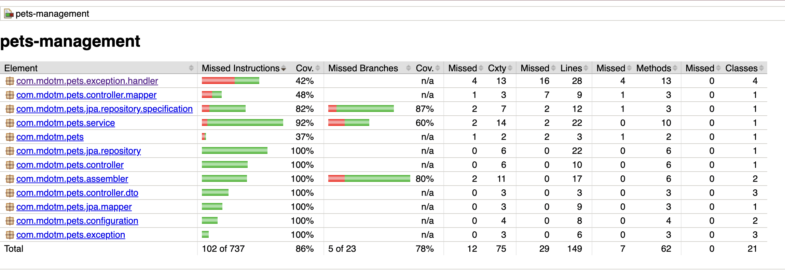

# pet-management

## Summary

Pet Management

This application can serve as the POC of a backend system for managing pets information.

It exposes REST APIs to create, update, patch, delete and get pet information.

## Technologies Used

* Java 21
* Maven 3.9.9
* Spring Boot 3.4.2
* Liquibase 4.29.2
* Postgres 42.7.5
* Lombok 1.18.36
* Jacoco Maven Plugin 0.8.12

## Project's Structure

The project uses spring boot for an easier start up development. The project has 3 main layers to achieve high cohesion and low coupling between classes.

API client -> Controller layer -> Service layer -> Repository layer -> DB

Additionally, there are mappers to convert POJOs from the REST DTOs to the domain's entities on database level.

### Controller

Controller class that serves as starting point for the implementation of the REST APIs.

```com.mdotm.pets.controller.PetOperationsController```

#### CREATE API

```com.mdotm.pets.controller.PetOperationsController.createPet```

Creates new pet resource.

#### UPDATE API

```com.mdotm.pets.controller.PetOperationsController.updatePetById```

Updates an existing information by ID.

#### GET API

```com.mdotm.pets.controller.PetOperationsController.getPetById```

Retrieves pet resource by ID

```com.mdotm.pets.controller.PetOperationsController.getAllPets```

Retrieves a list of pet information with the possibility of applying filtering, sorting and pagination.

#### DELETE API

```com.mdotm.pets.controller.PetOperationsController.deletePetById```

Deletes pet resource by ID

#### PATCH API

```com.mdotm.pets.controller.PetOperationsController.patchPetById```

Patches pet resource by ID

### Services

Service layer that is in between the REST Controller and JPA Repositories.
It's the entry point for the application's domain. An internal domain ```com.mdotm.pets.domain.Pet``` object is defined, so that application can integrate with different databases (both SQL and NoSQL).
Service calls the common repository interface ```com.mdotm.pets.repository.GenericPetRepository``` using the domain object, so that the layer is agnostic to the DB that is used.

Package: ```com.mdotm.pets.service```

### Repositories

Repository layer that runs operations on DB
```com.mdotm.pets.repository.GenericPetRepository``` defines the interface for which there can be different repository implementations depending on the DB that is used.
That's because each repository will work with its own entity that is assembled from the domain object ```com.mdotm.pets.domain.Pet```.
For now the application has only this ```com.mdotm.pets.jpa.repository.JpaPetRepositoryImpl``` repository implementation that can be used with relational DBs.

Package: ```com.mdotm.pets.repository```

### Exception Handling

There are specific exception handlers to map Exceptions thrown by the application into proper HTTP Status codes.

Exception handlers can be found under ```package com.mdotm.pets.exception.handler;```

## Instructions on how to run project

### Requirements

* Java 21 installed
* Maven installed
* Docker Desktop installed & running

### Get Started

1. Navigate to the project's directory
2. To build the project, run: ```mvn clean install```
3. To build docker image of the application, run: ```mvn clean install -P build-image```
4. To create and start docker container, run ```docker compose up```. Application will be ready once you read the following message: ```...PetsManagementApplication   : Started PetsManagementApplication in ...```
5. To navigate to the application's swagger documentation page, browse to: http://localhost:8080/pets-management-doc
6. To run test coverage with jacoco, run ```mvn clean test jacoco:report```. Browse the results by opening file at ```/target/site/jacoco/index.html```

### Credentials

1. Postgres DB: user/pass

#### Jacoco Results 404 Not Found page

If opening Jacoco's output ```index.html``` file from inside IntelliJ you might get a '404 Not Found' page.
Please open the html file normally without it being from IntelliJ.

### Test Coverage

JACOCO Maven plugin was configured to display test coverage of the project. In order to see the detailed reports run: ```mvn clean test jacoco:report```.
Current test coverage is **86%**!

